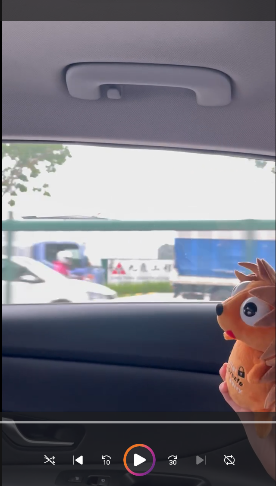
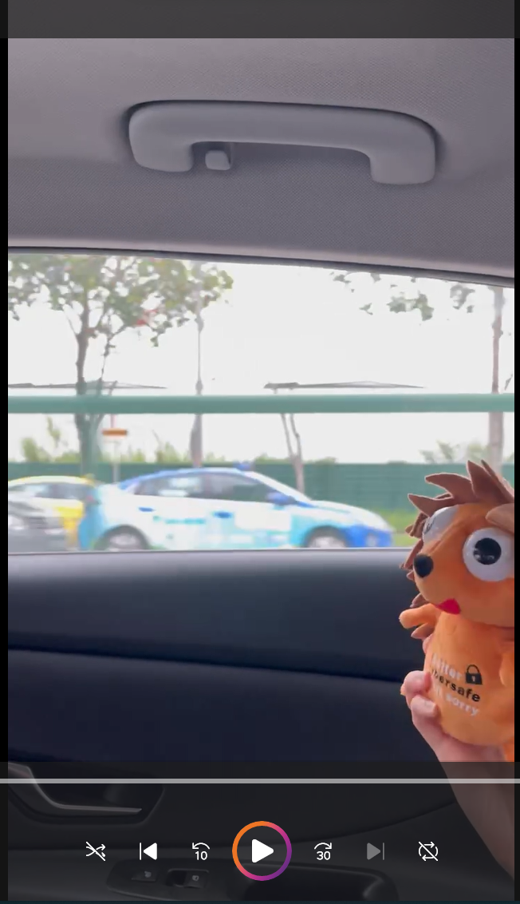
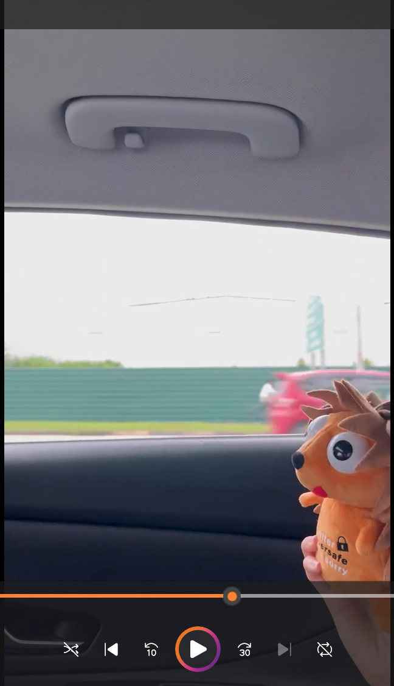
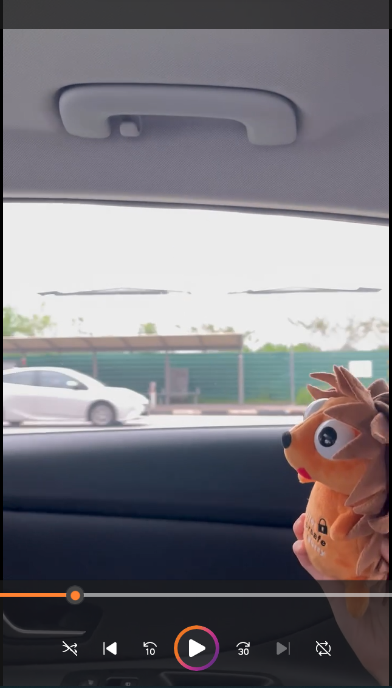
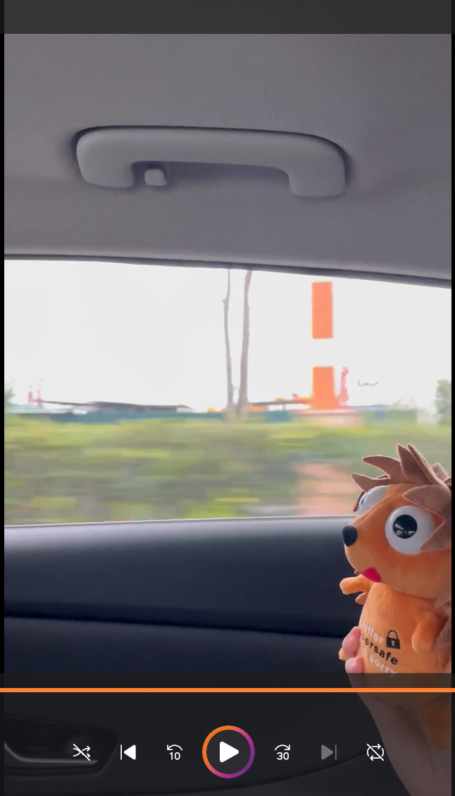
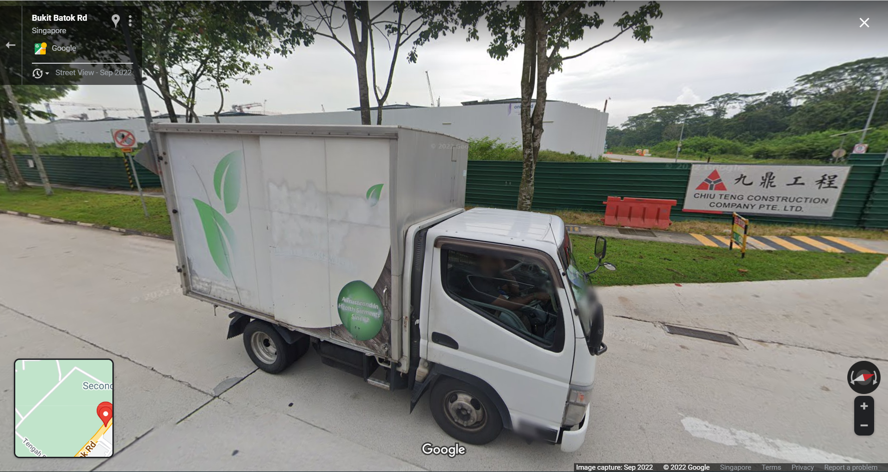
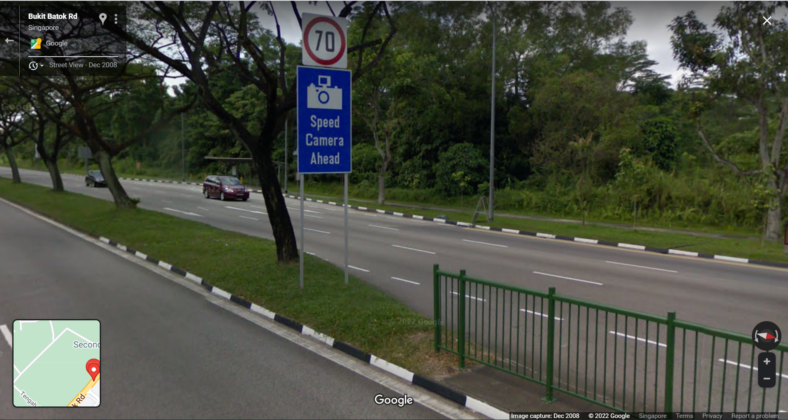
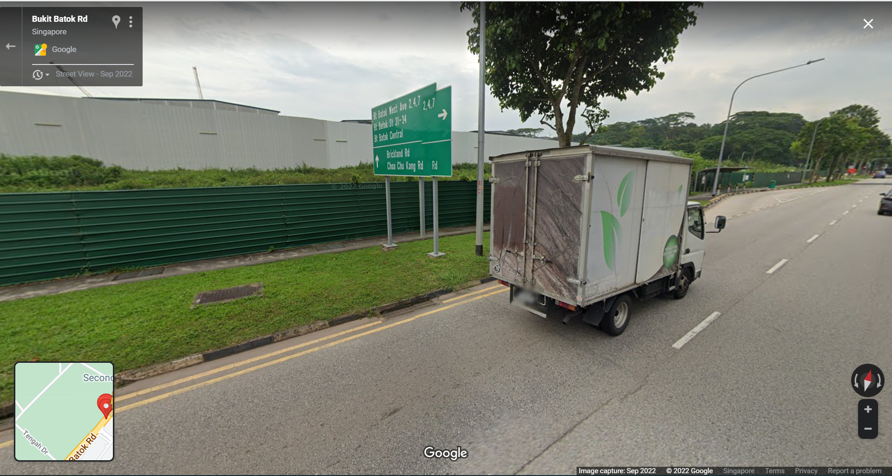
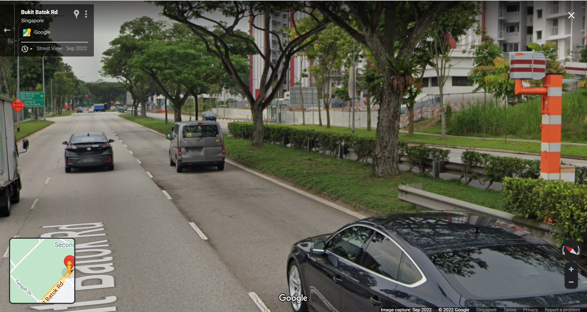

# Finding Nyan 
## Description
Jaga is on a road trip to find Nyan. Do you know which road this is in the metaverse?
Note that for this challenge, the road name should be CAPITAL LETTERS. For example - STF22{JLN_BINCHANG_RD}. The road name can be seen on Google Maps.

## Writeup
In order to solve this challenge, we first have to look for distinctive clues that will tell us more about this road. These clues must be able to help us work towards our answer and/or verify our answer. We find a few from the video.

Note: Important insights in **bold**.

1. The construction site has a sign indicating the construction company's name and logo. As Chinese characters are quite blurred out, we will not use this clue to move forward. Also, construction sites are temporary and may not be captured in Google Street View.


2. **The pair of royal blue and yellow taxis suggests that this video was taken in Singapore.** The royal blue taxi is a Hyundai ioniq which belongs to Comfort Taxi and the yellow one belongs to CityCab.

3. We can also barely make out the pedestrian crossing prohibition arrow sign in orange from the image below.



4. From the 2 images above, we can also see the green centre road divider.

5. From the image below, we can see the directional sign (rectangular sign with white lines and font).

6. We also a cyclist cycling along the road. **In Singapore, cycling is prohibited on expressways, so this leaves us with non-expressway roads.**


7. We see a bus stop along the road.


8. **There is a distinctive traffic camera in the centre road divider with its distinctive orange and white design.**


We search up on the types of traffic cameras in Singapore [here](https://www.motorist.sg/article/127/the-5-different-types-of-traffic-cameras-in-singapore). Since we did not see any traffic lights near the camera, we can deduce that the traffic camera is a (fixed/mobile) speed camera, rather than a red light camera.

Since apps such as Waze have the ability to flag up traffic cameras when driving, there's probably a database of all the traffic cameras in Singapore. Surely enough, we find it at [data.gov.sg](https://data.gov.sg/dataset/location-of-speed-enforcement-cameras).

Eliminating all the expressways and only including fixed/mobile speed cameras (clues 6 & 8), we get
```
Boon Lay Way
Bukit Batok Road
Holland Road
Loyang Avenue
Upper Thomson Road
Yishun Avenue 1
Yishun Avenue 2
Aviation Park Road
Lim Chu Kang Road
Punggol Central
Seletar Link
```

Going through the list, we find that Bukit Batok Road matches all our clues in Google Street View.

Clue 1 and 3: Construction company sign and pedestrian prohibition sign


Clue 4 and 7: Green road divider and bus stop in the background


Clue 5 and 7: Directional sign and bus stop (from another angle)


Clue 8: Traffic camera


## Flag
`STF22{BUKIT_BATOK_RD}`


