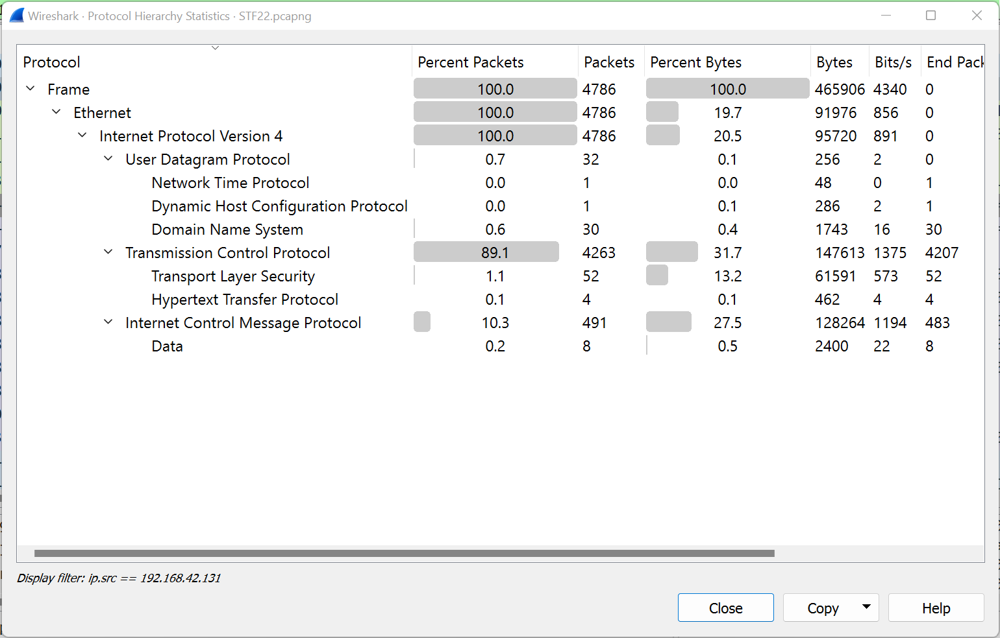

# Finding Nyan 
## Description
An adversary was observed to be exfiltrating a file from a music entertainment company that contains a to-be-released embargoed poster of a new song for one of their bands. Find the leaked file, which will contain the flag.

## Writeup
First steps: We try our luck with File > Export Object > HTTP.

No objects were found. This means that the file was not transmitted through HTTP/FTP and we would possibly need to look for it in other protocols.

Using the display filter `http`, we see that the HTTP requests were all from the IP address `192.168.42.131`. This suggests that that is our victim IP address.

Thus, we used the filter `ip.src == 192.168.42.131` to narrow down our search for packets originating from the victim IP. Below is the protocol hierachy statistics with the display filter.

Looking through the packets, we see a very high number of TCP [RST, ACK] and ICMP packets.

The TCP RST, ACK packets are all 0 length (see highlighted below), meaning that there is no payload. Hence, it is unlikely for the data to be exfiltrated through these packets.

We move on to the ICMP packets which seem to have unusually large payloads. A usual payload size is around 32 bytes but the ICMP packets have a payload size of around 256 bytes.

We can further narrow down our search using the display filter `ip.src == 192.168.42.131 && icmp[0] == 8`. This will only show us ICMP ping requests from the victim IP. Decoding the payload of the first ICMP ping request, we get the flag.

## Some commentary about this challenge
Data exfiltration through ICMP ping requests is a very smart method that most networks are vulnerable to. This is because ICMP ping requests are usually allowed by firewalls to leave the network to allow for easy troubleshooting of network issues.

## Flag
`STF22{Bl@ckPin9_V3n0m}`

## References
https://www.linkedin.com/pulse/exfiltrating-data-via-icmp-echo-requests-replies-david-burkett

