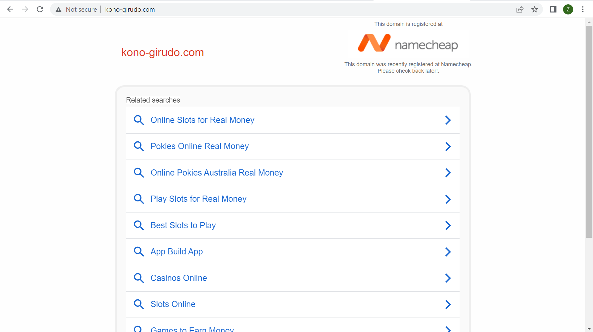
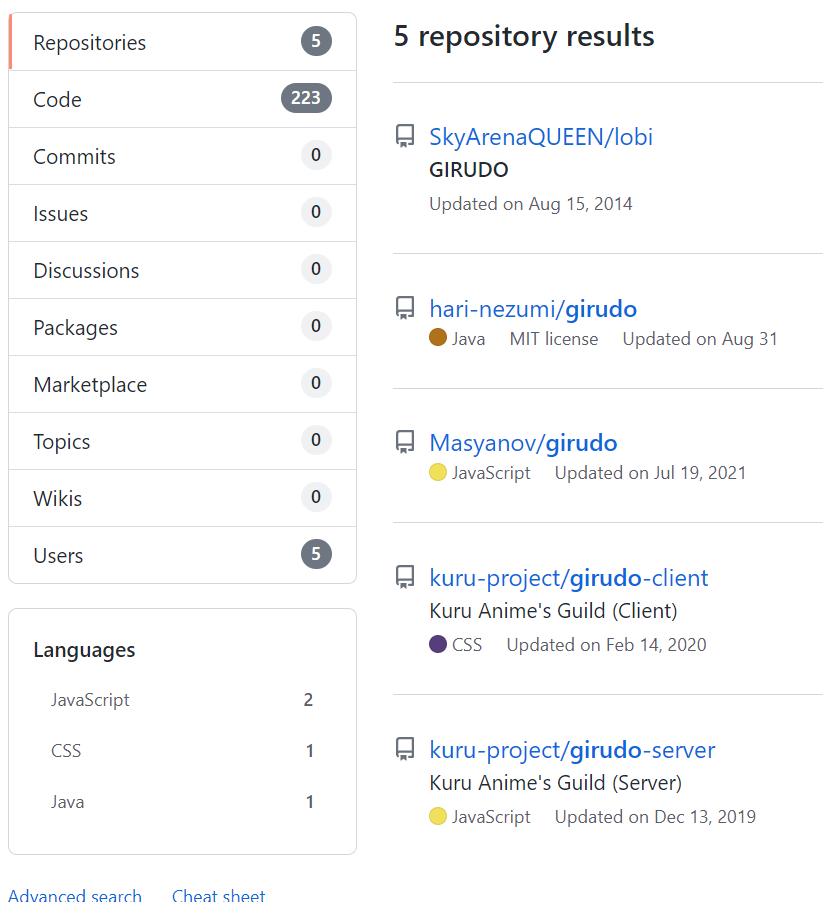
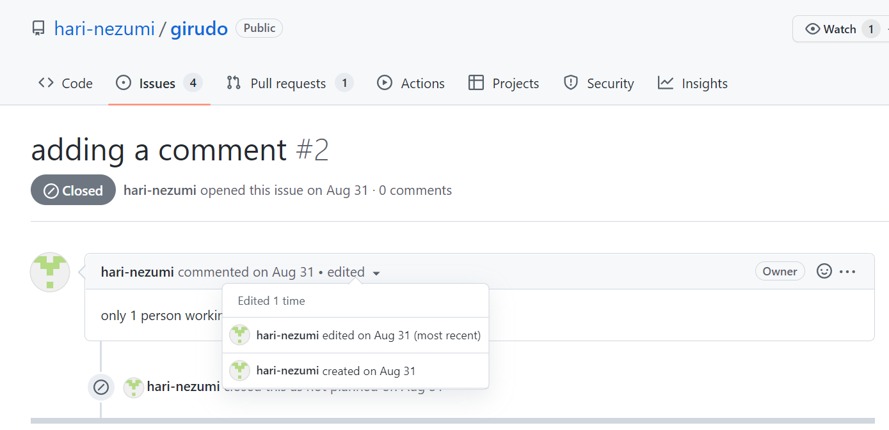
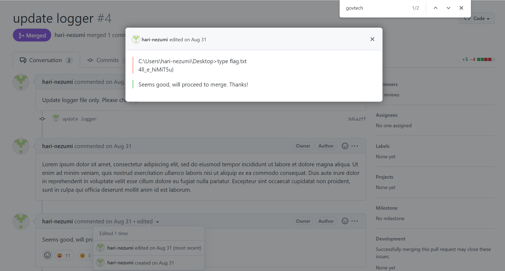

# New Tasks! 
## Description
Jaga got summoned to the new world and was given some new tasks to investigate why the employees of kono-girudo.com kept receiving phishing emails. It also seems like there is information disclosure for those working on Girudo project but could not find out where the disclosure was. Jaga needs your help to determine why they kept receiving phishing emails and what sensitive information was exposed for the project.

## Writeup
The challenge description suggests that there are 2 parts to this challenge: 1. the phishing emails & 2. information disclosure from the Girudo project. We will tackle the 2 parts separately as they do not seem to be linked.

### Part 1 - Phishing emails
Visiting the website `kono-girudo.com` does not reveal anything out of the ordinary. It is just a namecheap parking page.


Doing a whois lookup for the domain also doesn't return anything useful. Most of the fields are redacted.
```
Domain name: kono-girudo.com
Registry Domain ID: 2718665514_DOMAIN_COM-VRSN
Registrar WHOIS Server: whois.namecheap.com
Registrar URL: http://www.namecheap.com
Updated Date: 0001-01-01T00:00:00.00Z
Creation Date: 2022-08-17T02:13:57.00Z
Registrar Registration Expiration Date: 2023-08-17T02:13:57.00Z
Registrar: NAMECHEAP INC
Registrar IANA ID: 1068
Registrar Abuse Contact Email: abuse@namecheap.com
Registrar Abuse Contact Phone: +1.9854014545
Reseller: NAMECHEAP INC
Domain Status: clientTransferProhibited https://icann.org/epp#clientTransferProhibited
Domain Status: addPeriod https://icann.org/epp#addPeriod
Registry Registrant ID:
Registrant Name: Redacted for Privacy
Registrant Organization: Privacy service provided by Withheld for Privacy ehf
Registrant Street: Kalkofnsvegur 2
Registrant City: Reykjavik
Registrant State/Province: Capital Region
Registrant Postal Code: 101
Registrant Country: IS
Registrant Phone: +354.4212434
Registrant Phone Ext:
Registrant Fax:
Registrant Fax Ext:
Registrant Email: 240ff0613981435d942943723bb3cbcc.protect@withheldforprivacy.com
Registry Admin ID:
Admin Name: Redacted for Privacy
Admin Organization: Privacy service provided by Withheld for Privacy ehf
Admin Street: Kalkofnsvegur 2
Admin City: Reykjavik
Admin State/Province: Capital Region
Admin Postal Code: 101
Admin Country: IS
Admin Phone: +354.4212434
Admin Phone Ext:
Admin Fax:
Admin Fax Ext:
Admin Email: 240ff0613981435d942943723bb3cbcc.protect@withheldforprivacy.com
Registry Tech ID:
Tech Name: Redacted for Privacy
Tech Organization: Privacy service provided by Withheld for Privacy ehf
Tech Street: Kalkofnsvegur 2
Tech City: Reykjavik
Tech State/Province: Capital Region
Tech Postal Code: 101
Tech Country: IS
Tech Phone: +354.4212434
Tech Phone Ext:
Tech Fax:
Tech Fax Ext:
Tech Email: 240ff0613981435d942943723bb3cbcc.protect@withheldforprivacy.com
Name Server: dns1.registrar-servers.com
Name Server: dns2.registrar-servers.com
DNSSEC: unsigned
```

Since we only have the domain name to work with, the next logical step is to do a DNS lookup. But which specific records do we look for? Since the challenge description mentioned about phishing emails, I decided to google "phishing email dns record", which brought me to [this cloudflare blogpost](https://blog.cloudflare.com/tackling-email-spoofing/).

From the blogpost, we learnt that there are 3 anti-spoofing mechanisms built into DNS.
1. Sender Policy Framework (SPF) which helps to detect emails with spoofed sender addresses from an unauthorized email server.
2. DomainKeys Identified Mail (DKIM) which allows parts of the emails to be cryptographically signed and thereafter verified by the recipient email server.
3. Domain-based Message Authentication Reporting and Conformance (DMARC) which specifies a policy on what to do with emails that failed the SPF or DKIM checks. 

Doing a DNS TXT record lookup on `kono-girudo.com`, we get the following result with the SPF record.
```
$ nslookup -type=txt kono-girudo.com
Server:         172.26.96.1
Address:        172.26.96.1#53

Non-authoritative answer:
kono-girudo.com text = "v=spf1 include:spf.efwd.registrar-servers.com ~all"

Authoritative answers can be found from:
```

DKIM records are unlike most TXT records, in that they are not stored under the domain name, but rather in this format: `[selector]._domainkey.[domain]`. The selector is an arbitary string which indicates where the public key exists in the DNS records. Different email service providers (such as Google & Microsoft) use different selector values so it is futile to try to enumerate the selector (which can take on infinite possible values).

This leaves us with DMARC. Luckily for us, DMARC records can be found under `_dmarc.[domain]`, which gives us the first part of the flag:
```
$ nslookup -type=txt _dmarc.kono-girudo.com
Server:         172.26.96.1
Address:        172.26.96.1#53

Non-authoritative answer:
_dmarc.kono-girudo.com  text = "v=DMARC1; p=none; STF22{le4k3d_"

Authoritative answers can be found from:
```

#### Sidetrack: Why is kono-girudo.com susceptible to phishing emails?
For SPF policy, there are 3 options on what to do with emails coming from unauthorized IP addresses.

1. Neutral (`?all`)
2. Soft fail (`~all`)
3. Hard fail (`-all`)

However, there are no defined protocols on what actions are to be taken with spoofed emails. This means that different email providers may treat soft fail emails differently. In the case of `kono-girudo.com`, it has a soft fail policy, which means the email may be sent to spam, undelivered at all, or even successfully delivered to the recipient's inbox!

For DMARC policy, there are again 3 options on what to do with emails failing SPF or DMARC check.

1. Do nothing (`p=none`)
2. Send to spam (`p=quarantine`)
3. Do not deliver to recipient (`p=reject`)

For `kono-girudo`, its DMARC policy is none. This combined with its soft fail SPF policy, explains why the employees kept receiving phishing emails. To stop this from happening, the DMARC policy should be either quarantine or reject. No changes is needed to the SPF policy since DMARC takes priority over SPF.


### Part 2 - Information disclosure
The words "project" and "information disclosure" suggests to me that we should search in either GitHub or GitLab. This is because developers often commit sensitive information to repositories without realising. Since Git tracks changes in files, we can often retrieve these sensitive information even after they have been overwritten.

A GitHub search on "Girudo" returns the following results.


We quickly found that hari-nezumi/girudo is our target. This is because at the bottom of the README.md, the first author `@imthomas93`'s GitHub profile suggests that he is working at GovTech Singapore, the organizer of this CTF. In real world context, he is an employee of the organization that we are collecting intelligence on. Furthermore, AutoWasp is a govtech-csg project, as the `Building the jar` instructions suggests.

Looking through the commit history, we find nothing of note. The Issues tab also provides no clues as to what "sensitive information" was disclosed. However, we found an editted comment, which can be used to hide information.


Looking through the pull requests, we finally found the second part of the flag in yet another editted comment.


## Flag
Combining both parts, we get
`STF22{le4k3d_4ll_e_hiMiT5u}`

### References
1. https://limbenjamin.com/articles/spf-dkim-dmarc-in-a-nutshell.html
2. https://www.proofpoint.com/us/threat-reference/spf
3. https://www.proofpoint.com/us/threat-reference/dkim
4. https://www.proofpoint.com/us/threat-reference/dmarc
